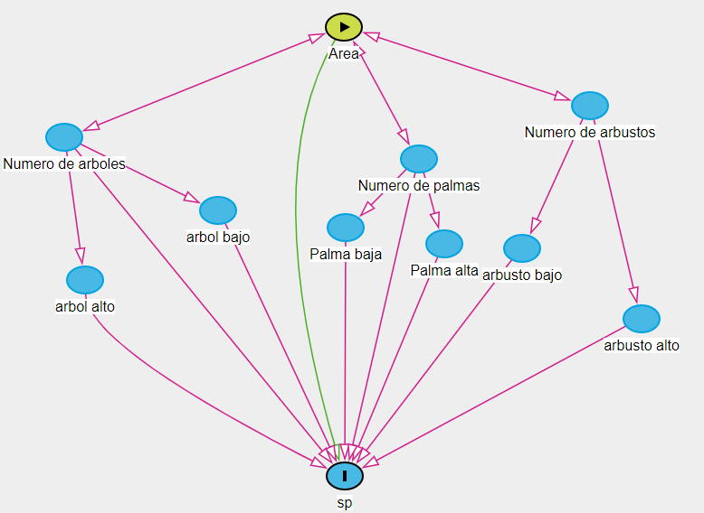

# Proyecto Final!


### ¿Cual es la pregunta especifica  de la investigacion?

La pregunta corresponde a cual seria el efecto del area de un zona o sitio y la disponibilidad de vegetación en la riqueza de especies de aves en parques urbanos ubicados en Costa Ria.

Los datos fueron recolectados por 6 personas, Gabriel Ugarte, Camila valverde, Bernadeth Cubillo, Jason Martinez, Tatiana Rodriguez y mi persona

### ¿Cuales son la variables relevantes y cual es su relacion, conocida y/o hipotetica?

Entre las variables presentes en la investigación, tenemos el area en m2 de los diversos parques para el muestreo, de forma que entre mas grandes sean, mayor riqueza de aves va a haber, mientras que si son pequeño, la riqueza de aves va a hacer minima.
Otra de las variables, es el número de árboles, que sigue un mismo camino, entre más hay, mayor numero de especies de aves, pero dentro de este tambien entran dos variables, lo que corresponde a su tamaño, clasificando arboles grandes y pequeños difereciandolos por el metro 3, los mismo con el número de arbustos y palmeras, misma dinamica, dos variables y diferencia de tamaños. En estas últimas variables la presencia de mas arboles grandes o altos determinaba mayor riqueza, esperando lo contrario con los arboles pequeños.



### ¿De dónde vienen los datos? Si son datos empíricos debe incluir el código para su procesamiento desde datos crudos, hasta datos analizables. Si son datos simulados debe incluir el código de simulación


Los datos vienen de la recolecta de datos durante dos dias, exactamente el 1 y 2 de noviembre de 2019, se tomaron desde las 6:00 am hasta las 8:20 am, de los  cuales se hicieron puntos de muestreo de 20 minutos, para avistar las aves, con un radio de vision de 15 a 20 metros, cada punto se separo por 15 m. 

Se tomaron en 6 parques diferentes, ubicados en diferentes zonas, principalmente en San Jose, el Parque de Sabanilla (9°56'44.5"N 84°02'02.7"W), el Parque Itskazu (9°56'06.5"N 84°08'06.0"W), el Parque de Granadilla (9°56'12.1"N 84°00'58.4"W) y el Parque de Pinares, el Parque Central de Santo Domingo de Heredia en la provincia de Heredia (9°58'47.8"N 84°05'27.7"W) y el Parque de Lomas de Altamira de la Guácima en la provincia de Alajuela (9°57'52.2"N 84°15'24.4"W).

Codigo de procesamiento

```{r}
#En primer lugar la activacion de los Packages a utilizar

library(tidyverse)
library(ggplot2) 
library(dplyr)
library(tidyr)
library(readr) 

# Abrir los datos y ver su contenido

setwd('C:/Users/Est3ban/Desktop/Proyecto') 

modelo_final <- read_csv("modelo_final.csv") 

modelo_final 

glimpse(modelo_final)

summary(modelo_final) 

View(modelo_final)

```


```{r}

# Luego se realiza un grafio, en cual indica el numero de especies entre el las diferentes variables, como arbol alto, entre  los  otros

modelo_final %>% select(-Parque) %>% select(-ID) %>%
  gather(key = "variable", value = "valor", -sp) %>%
  ggplot(aes(x = valor, y = sp)) +
  geom_point() +
  facet_wrap(~ variable, scales = "free")

#Luego se observa la correlación de las diferentes variables

modelo_final %>% select(-Parque)  %>% cor()

#de las cuales parece haber una correlacion con: 
    #el area principalmente 
    #Arboles altos 
    #numero arbusto 
    #numero Arboles

```

```{r}
#Seguidamente se hacen test de correlación, para determinar si hay correlacion significativa con el p-value

cor.test(modelo_final$sp, modelo_final$area_m2) 
#Pvalue menor a 0.05, correlacion significativa con respecto al área

cor.test(modelo_final$sp, modelo_final$arbol_alto) 
#Pvalue en 0.05, se redondea a 0.06, no hay correlacion con respecto al número de arboles altos

cor.test(modelo_final$sp, modelo_final$arbol_peq)
#Pvalue mayor a 0.05, no se puede asumir una correlacion significativa con respecto al numero de arboles pequeños

cor.test(modelo_final$sp, modelo_final$arbusto_alt) 
#Pvalue menor a 0.05, correlacion significativa con respecto a numero de arbustos altos

cor.test(modelo_final$sp, modelo_final$arbusto_peq) 
#Pvalue menor a 0.05, correlacion significativa con respecto a numero de arbustos  pequeños

cor.test(modelo_final$sp, modelo_final$palma_alt) 
#Pvalue mayor a 0.05, no se puede asumir una correlacion significativa con respecto a numero de palmas altas

cor.test(modelo_final$sp, modelo_final$palma_peq) 
#Pvalue mayor a 0.05, no se puede asumir una correlacion significativa con respecto a numero de palmas pequeñas

cor.test(modelo_final$sp, modelo_final$numero_palma)
#pvalue menor a 0.05. NO hay correlación con respecto a numero de palmas

cor.test(modelo_final$sp, modelo_final$numero_arboles)  
#Pvalue MAYOR a 0.05. Si hay correlación con respecto a numero de arboles

cor.test(modelo_final$sp, modelo_final$numero_arbustos)  
#pvalue MAYOR a 0.05. Si hay correlación con respecto a numero de arbustos

#En resumen, las unicas variables que parecen tener una correlacion significativa con el numero de especies de aves es
  #1) Area 
  #2) Arbusto alto 
  #3) Arbusto pequeño 
  #4) Numero_arboles 
  #5) Numero_arbustos

```

```{r}
#Comando para formar un grafico de correlación entre las variables y las especies

library(GGally)
modelo_final %>% select(-Parque) %>% select(-ID) %>% ggcorr()

# Lo cual se Nota correlacion alta entre especie y 
                            #1)area 
                            #2)arbusto_alt 
                            #3)numero_arboles 
                            #4)numero_arbusto

```

```{r}
#Seguidamente se ajustan modelos lineales entre especies y las diferentes variables determindas en el analisis

#Base
mod0<- lm(sp ~ 1, data = modelo_final)

#Area
mod1 <- lm(sp ~ area_m2, data = modelo_final)

#Numero de arboles altos
mod2 <- lm(sp ~ arbol_alto, data = modelo_final)

#Numero de arboles pequeños
mod3 <- lm(sp ~ arbol_peq, data = modelo_final)

#Numero de arbustos altos
mod4 <- lm(sp ~ arbusto_alt, data = modelo_final)

#Numero de arbustos pequeños
mod5 <- lm(sp ~ arbusto_peq, data = modelo_final)

#Numero de palmas altas
mod6 <- lm(sp ~ palma_alt, data = modelo_final)

#Numero de palmas pequeñas
mod7 <- lm(sp ~ palma_peq, data = modelo_final)

#Numero de palmas
mod8 <-lm(sp ~ numero_palma, data = modelo_final) 

#Numero de arboles
mod9 <- lm(sp ~ numero_arboles, data = modelo_final) 

#Numero de arbustos
mod10 <- lm(sp ~ numero_arbustos, data = modelo_final) 


```

```{r}
#Para veer datos de los modelos lineales

summary(mod0)

summary(mod1) 
# 97% of the variance found in the response variable sp 
#can be explained by the area

summary(mod2) 
# 56% of the variance found in sp 
#can be explained by arbol alto

summary(mod3)  
# 61% of the variance found in sp 
#can be explained by arbol peq

summary(mod4) 
# 75% of the variance found in sp 
#can be explained by the arbusto alto

summary(mod5) 
# arbusto pequeño NO explica

summary(mod6) 
# palmas altas no explican nada 

summary(mod7) 
#palmas pequenas no explican nada

summary(mod8) 
#palmas totales tampoco explican nada 

summary(mod9) 
# numero arboles totales si explica.
# 79% of the variance found in sp can be explained by numero arboles

summary(mod10)  
# 69% of the variance found in sp can be explained by numero arbustos

```

```{r}
# Seguidamente un comando para ponerle el nombre a las variables, y el grafico del principio, pero generando una recta lineal

variable.names<-c("Área en m2",
                  "Árboles altos",
                  "Árboles pequeños",
                  "Arbustos altos",
                  "Arbustos pequeños",
                  "Palmas altas",
                  "Palmas pequeñas",
                  "Árboles totales", 
                  "Arbustos totales",
                  "Palmas totales")

variable.names

names(variable.names)<-names(modelo_final[,-(1:3)])
modelo_final %>% select(-Parque) %>% select(-ID) %>%
  gather(key = "variable", value = "valor", -sp) %>% 
  ggplot(aes(x = valor, y = sp)) +
  ylab("Número de especies de aves")+
  xlab("Variable del parque")+
  geom_point() +
  facet_wrap(~ variable, scales = "free", labeller=labeller(variable=variable.names))+
  geom_smooth(method = "lm")

```


```{r}

#Finalmente se analizan los AIC y se compara con el valor  R2
AIC <- AIC(mod1, 
           mod2,
           mod3,
           mod4,
           mod5,
           mod6,
           mod7,
           mod8,
           mod9,
           mod10) 

R2 <- c(summary(mod1)$r.squared,
        summary(mod2)$r.squared,
        summary(mod3)$r.squared,
        summary(mod4)$r.squared,
        summary(mod5)$r.squared,
        summary(mod6)$r.squared,
        summary(mod7)$r.squared,
        summary(mod8)$r.squared,
        summary(mod9)$r.squared,
        summary(mod10)$r.squared)

AIC <- AIC(mod1, 
           mod2,
           mod3,
           mod4,
           mod5,
           mod6,
           mod7,
           mod8,
           mod9,
           mod10) 

AIC$r2 <- R2 
AIC


#Los modelos con el MENOR AIC y MAYOR R2 son: 
#mod1, mod4, mod10 y mod11. 
#mod1(area), mod10 (numero_arboles) y mod11(numero arbustos). 
#Se podria incluir  mod4(arbusto alto),pero el r2 es menor de 0,80

```

### 4. Análisis de los datos. Se vale escoger un subconjunto de los datos para que esta sección sea concisa, pero debe ser un análisis coherente con el DAG del punto 2.

Lo que se analizo fueron modelos de correlación, modelos lineales y los AIC, R2 y p-value de las diferentes variantes que afectaban la riqueza de especies de aves en los diferentes parques, en tal caso, mediante los modelos de correlación, tanto en los cor.test de los cuales, solo cinco de las variantes constituyen a un valor p-value menor a 0.05, por lo que constituyen a una correlación significativa, siendo el Area, arbusto alto, arbusto pequeño, numero de arbustos y numeros de arboles, lo que podria indicar que si tienen un efecto con la riqueza de especies en los parques, mientras que en el modelo de correlación, se puede determinar una correlación con el area, numero de arboles y arbustos, y la diferencia es que hay correlación con los arboles altos, de igual forma en el grafico de correlación.

Con respecto a los analisis de AIC comparados con R2, los modeles con menor AIC y mayor R2 son los modelos lineales de 1, 4, 10 y 11, que de forma correspondiente son los modelos lineales de las variantes de Area, arboles altos, numero de arboles y numero de arbustos.

### 5. Interpretación breve de los resultados con respecto a la  pregunta de investigación y la hipótesis causal. Máximo un párrafo.

Lo que se pudo obtener de los resultados, fue, que se determino una correlación entre la riqueza de especies y 4 de las variantes determinadas que podia afectar de cierta forma la riqueza de especies, siendo estos, el area, numero de arboles altos, numero de arboles en general y numero de arbustos en general, lo que determina que esas cuatro variantes, son determinantes para la riqueza de especies, siendo asi que todos los analisis hechos daban como resultados sus correlaciones, exepto en el cor.test, que la variante de arboles altos no fue una correlación significativa.

```{r setup, include=FALSE}
knitr::opts_chunk$set(echo = TRUE)
```

## R Markdown

This is an R Markdown document. Markdown is a simple formatting syntax for authoring HTML, PDF, and MS Word documents. For more details on using R Markdown see <http://rmarkdown.rstudio.com>.

When you click the **Knit** button a document will be generated that includes both content as well as the output of any embedded R code chunks within the document. You can embed an R code chunk like this:

```{r cars}
summary(cars)
```

## Including Plots

You can also embed plots, for example:

```{r pressure, echo=FALSE}
plot(pressure)
```

Note that the `echo = FALSE` parameter was added to the code chunk to prevent printing of the R code that generated the plot.
